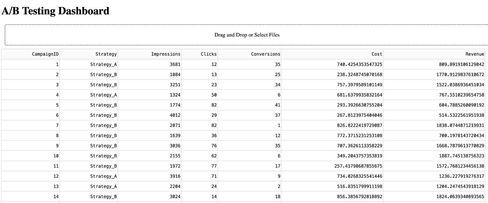

# Prototype-Dashboard-for-A-B-testing

## Features

- Upload your own dataset
- Choose metrics to perform A/B testing
- Interactive data visualization
- Statistical analysis with real-time results

We will be comparing two different strategies (Strategy_A and Strategy_B) on various metrics like Impressions, Clicks, Conversions, Cost, and Revenue. The choice of what to compare depends on what aspect of the strategies you're interested in analyzing. Let's discuss a few scenarios:

1. Comparing Conversion Rates
We might be interested in whether there's a significant difference in the conversion rates between Strategy_A and Strategy_B. For this, we would compare the Conversions metric between the two groups.

2. Cost-Effectiveness
Another comparison could be to see which strategy is more cost-effective. This might involve comparing the Cost metric or even calculating the Cost per Conversion or Return on Investment (ROI) and comparing these values.

3. Click-Through Rates (CTR)
If the focus is on the effectiveness of the ad in terms of engagement, we might compare the Click-Through Rates (CTR) which can be calculated as Clicks divided by Impressions.

4. Revenue
Finally, we might want to compare the Revenue generated from each strategy to see which is more profitable.
